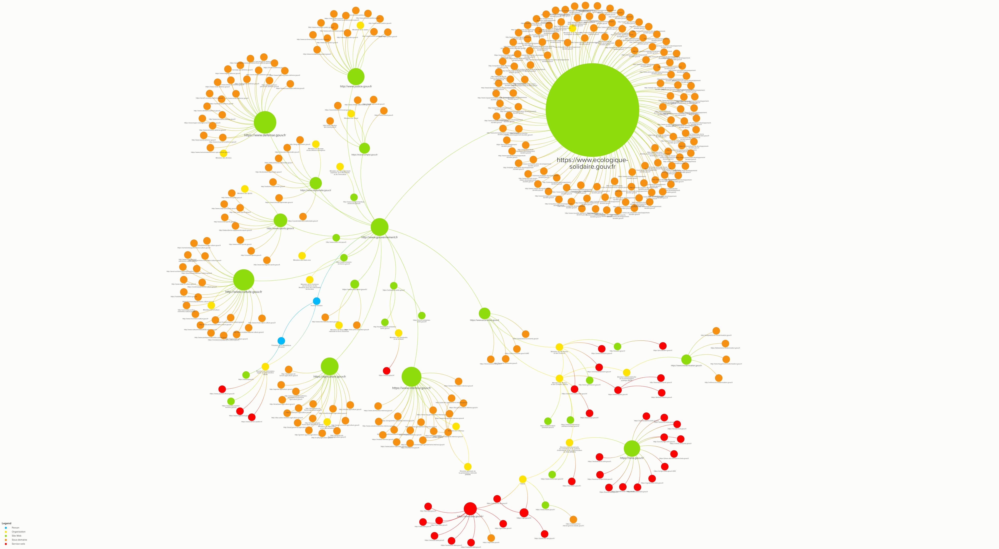

# Représentation en *graph* des sites et services web publics de l'État

**Carte V2 : [gouvfr.jbledevehat.fr](https://gouvfr.jbledevehat.fr)** · carte V1 (2019) :
[Kumu](https://kumu.io/jbledevehat/sites-web-gouvfr#liste-des-sites-web-en-gouvfr-v1)

Ce dépôt contient l'outil de mise à jour de la carte de 2019 (voir [Version 1](#version-1-2019)).

Il part de la carte V1 (2019), vérifie chaque site, ajoute les sites publics manquants et
produit le jeu de données complet d'une **carte V2** à importer dans Kumu, avec un rapport des
changements. Kumu n'offrant pas d'API d'écriture, l'import reste manuel.

## Prérequis

Node.js 20 ou plus, puis `npm install` (graphology, pour le placement du graphe et l'export GEXF).

## Utilisation

```bash
npm run update
```

enchaîne les quatre étapes, qui peuvent aussi être lancées séparément :

| Commande | Rôle | Sortie |
|---|---|---|
| `npm run fetch:kumu` | Instantané de la carte publique (éléments, connexions, description) via l'API CouchDB de Kumu | `donnees/kumu/` |
| `npm run fetch:sources` | Liste DINUM des [noms de domaine des organismes publics](https://gitlab.adullact.net/dinum/noms-de-domaine-organismes-secteur-public) (filtrée sur `gouv.fr`), services nationaux de l'[Annuaire de l'administration](https://lannuaire.service-public.gouv.fr) ([API](https://api-lannuaire.service-public.fr)) et liste des opérateurs de l'État du PLF | `donnees/sources/` (non versionné) |
| `npm run check` | Vérifie en HTTP chaque URL de la carte et chaque nouveau domaine candidat | `donnees/checks/AAAA-MM-JJ.json` |
| `npm run build` | Calcule les changements, génère le jeu de données V2, le graphe et le rapport | `out/` |

Options de `check` : `--limit=N` (tester sur N URLs), `--only=map`, `--only=candidates` ou
`--only=unknown` (seulement les URLs restées indéterminées) ; le reste est repris de la
vérification précédente.

## Règles appliquées

**Éléments existants** (tous ceux dont le libellé est une URL) :

| Résultat de la vérification | Effet |
|---|---|
| En ligne (2xx/3xx, ou 401/403) | Type inchangé ; un « Site off/archivé » revenu en ligne repasse en « Site web » |
| Redirigé vers un autre site | Passe en « Site off/archivé » (sauf « Service web » : les redirections d'authentification sont normales) |
| Hors ligne (domaine inexistant, connexion refusée, 404/410) | Passe en « Site off/archivé » |
| Indéterminé (limitation de débit, timeout, 5xx…) | Type inchangé, listé dans le rapport pour revérification |

Chaque élément reçoit les champs `Statut`, `Code HTTP`, `URL finale`, `Erreur`, `Vérifié le`,
et `Type précédent` quand son type change. Les libellés ne sont jamais modifiés : c'est la clé
de correspondance lors de l'import.

Chaque URL est essayée en http, en https, puis avec `www.`, et les échecs sont réessayés plus
lentement. Un serveur au certificat TLS mal configuré est considéré comme en ligne (l'erreur est
notée dans `Erreur`). Les requêtes vers une même adresse IP sont limitées (`perIp`, `perIpGapMs`) : la plateforme
mutualisée des préfectures bannit pendant quelques heures les clients trop rapides. Si des
préfectures restent « indéterminées », relancer plus tard `node src/cli.mjs check --only=unknown`
puis `npm run build`.

**Nouveaux sites**, s'ils répondent et ne ressemblent pas à des noms techniques (`api.`,
`mail.`, `recette`, `preprod`…, voir `config/config.json`) :

- sites déclarés par les services nationaux (catégorie `SI`) de l'Annuaire de l'administration,
  quel que soit le domaine (`ademe.fr`, `insee.fr`…). Les ordres professionnels, associations,
  ambassades, collectivités, etc. sont exclus (`sources.annuaire.excludeTypes`). L'organisme,
  son type et sa tutelle (la racine de sa hiérarchie dans l'annuaire) sont repris en attributs ;
- domaines `*.gouv.fr` de la liste DINUM. Les sous-domaines ne sont pas proposés par défaut
  (`includeSubdomains`).

Ils sont ajoutés en « Site web » avec les tags `Nouveau` et `À rattacher`.

**Administrations** (reprises de l'Annuaire de l'administration) :

- chaque nouveau site est relié au service qui le déclare dans l'annuaire (ou, pour un domaine
  DINUM, au service de même SIREN), et ce service à son ministère de tutelle, c'est-à-dire le plus
  proche ancêtre ministériel dans la hiérarchie de l'annuaire ;
- l'annuaire ne relie pas les établissements publics à leur ministère : ils sont rapprochés (par
  nom ou sigle) de la [liste des opérateurs de l'État](https://www.data.gouv.fr/datasets/projet-de-loi-de-finances-pour-2026-plf-2026-jaune-operateurs-de-letat-liste-des-operateurs-et-categories)
  (annexe « jaune » du PLF), dont le programme budgétaire chef de file donne le ministère via
  `config/programmes-ministeres.csv`. Ils reçoivent le tag `Opérateur de l'État` et les champs
  `Statut juridique` et `Programme chef de file`. Ceux qui restent sans ministère (autorités
  indépendantes, institutions…) reçoivent le tag `Tutelle à préciser` ;
- les administrations de la V1 prennent leur intitulé actuel selon
  `config/correspondances-2019.csv` (l'ancien est conservé dans `Intitulé 2019`), et leurs
  connexions suivent. À mettre à jour après chaque remaniement ;
- `config/rattachements.csv` (`domaine,administration`) force le rattachement d'un site ;
- les sites restés sans rattachement ont le tag `À rattacher` et sont listés dans
  `out/a-rattacher.csv`.

## Visualiser la carte V2

Kumu n'étant utilisable qu'avec un abonnement, `build` produit aussi :

- `out/web/` : une page autonome (sigma.js) avec recherche, légende filtrante, mise en avant
  des ajouts de la V2 et fiche de chaque élément. Elle se publie telle quelle, par exemple sur
  GitHub Pages. Lien direct vers un élément : `index.html#ademe.fr`. Source : `web/carte.html`.
  Pour la voir en local : `python3 -m http.server 8765 --directory out/web`.
- `out/sites-gouv-fr-v2.gexf` : le graphe (positions, couleurs, attributs), à ouvrir dans
  [Gephi](https://gephi.org), [Gephi Lite](https://gephi.org/gephi-lite/) ou à publier avec
  [Retina](https://ouestware.gitlab.io/retina/).

Le placement est calculé pendant `build` : chaque élément rejoint le pôle du ministère (ou de la
Présidence, du Premier ministre, ou les pôles « Autorités indépendantes » et « Institutions et
juridictions » selon le type d'organisme de l'annuaire) le plus proche dans le graphe, chaque pôle est disposé avec
ForceAtlas2, puis les pôles sont répartis en bulles. Les éléments sans lien vers un ministère
forment le pôle « Sans ministère identifié », en périphérie. La page affiche le nom des pôles et
permet d'aller directement à l'un d'eux.

## Publication sur gouvfr.jbledevehat.fr

La GitHub Action [`carte.yml`](.github/workflows/carte.yml) publie `out/web/` sur GitHub Pages :

- à chaque push sur `master`, la carte est reconstruite à partir des vérifications HTTP
  versionnées dans `donnees/checks/` ;
- le 1er de chaque mois (ou à la demande, option « complet »), toutes les vérifications HTTP sont
  relancées et leurs résultats versionnés avant publication.

Le domaine est fixé par `site.domain` dans `config/config.json` (fichier `CNAME` généré). Côté
DNS (OVH), un enregistrement `CNAME` `gouvfr` → `jbledevehat.github.io.` le fait pointer vers
GitHub Pages.

## Import dans Kumu (optionnel, abonnement requis)

`out/kumu-v2.json` contient **toute** la carte : les éléments et connexions de la V1 (types,
statuts et intitulés mis à jour) plus les nouveaux sites et administrations. `out/elements.csv` et `out/connections.csv` en sont
l'équivalent tableur.

Dans Kumu, les éléments appartiennent au **projet**, pas à la carte : une carte V2 créée dans le
même projet que la V1 modifierait aussi les éléments de la V1. Pour conserver la V1 telle quelle :

1. Relire `out/rapport.md`.
2. Créer un nouveau projet Kumu (par exemple `sites-web-gouvfr-v2`), avec une carte
   « Liste des sites web publics (V2) ».
3. Menu **+** (en bas à droite) → **Import** → choisir `out/kumu-v2.json`.
4. Reprendre la vue et la légende de la V1 : coller `donnees/kumu/perspective.css` dans l'éditeur
   avancé de la vue (*Settings* → *Advanced editor*) ; ajouter une couleur pour le tag `Nouveau`
   si besoin.
5. Renseigner la description de la carte (sources, date de mise à jour).

Pour les mises à jour suivantes, pointer `kumu.project` de `config/config.json` vers le projet V2.

## Configuration

`config/config.json` : projet Kumu, sources (l'URL de la liste des opérateurs est à changer à
chaque nouveau PLF), paramètres de vérification (`concurrency`,
`timeoutMs`) et filtres des candidats. Une concurrence trop élevée déclenche la limitation de
débit des hébergements mutualisés de l'État (sites des préfectures notamment).

## Version 1 (2019)

La première version de la carte, réalisée à la main sous Kumu. Ses données et images sont conservées dans `Data/` et `SitesWebGouvFr/`.

Suite à la liste des sites web en `.gouv.fr` générée sur le dépôt [GitHub gouvfrlist](https://github.com/bzg/gouvfrlist/blob/master/tested.gouv.fr.txt), voici une représentation des domaines et sous-domaines par ministère et administrations (déconcentrées). Nous nous sommes également appuyé sur la liste du [**top 250** des démarches administratives](https://www.numerique.gouv.fr/actualites/qualite-des-services-numeriques-deux-nouveaux-outils-pour-suivre-lavancee-de-la-dematerialisation-et-recueillir-lavis-des-usagers/), la [liste des sites en .gouv.fr datant de 2014](https://www.data.gouv.fr/fr/datasets/listes-des-sites-gouv-fr/) et surtout la [liste des noms de domaine `.fr` de l'AFNIC en open data](https://opendata.afnic.fr) .



### Représentations 

Les objets représentés sont :
- Le Président de la République française et le Premier ministre sont qualifiés sous le type "Person" (en bleu)
- Les ministères ou directions administratives (en jaune)
- Les sites web (en vert)
- Les sous-domaines de ces sites-web (en orange)
- Les services en ligne (en rouge)
- Les sites web de consultation citoyenne (en rose)
- Les sites web off ou archivés (en noir)


### Publications web

Cette représentation est accessible sur l'application *KUMU* à l'adresse suivante : 

**[https://kumu.io/jbledevehat/sites-web-gouvfr#liste-des-sites-web-en-gouvfr-v1](https://kumu.io/jbledevehat/sites-web-gouvfr#liste-des-sites-web-en-gouvfr-v1)**

Les données ont été retraitées et sont accessible dans **[ce fichier d'import KUMU](/Data/Import-KUMU-SitesWeb-AdministrationsPubliques.xlsx)** et sont publiées sur un [jeu de données sur data.gouv.fr](https://www.data.gouv.fr/fr/datasets/listes-des-sites-et-services-web-en-gouv-fr/)

Les [noms de domaines considérés comme (possiblement) inutile/inutilisé sont listés dans le fichier contenant les noms de domaines en `gouv.fr` de l'AFNIC de Juillet 2019](/Data/AFNIC-gouvfr-201907.xlsx).

## Contributions

Ce dépôt est ouvert aux contributions - vous pouvez :

- poser une question sur le contenu en ouvrant une issue ;
- *forker* le dépôt et envoyer des *pull request* avec des propositions d'amélioration.

Merci !

## Licence

[Licence Ouverte 2.0](LICENSE.md) — Jean-Baptiste Le Dévéhat
