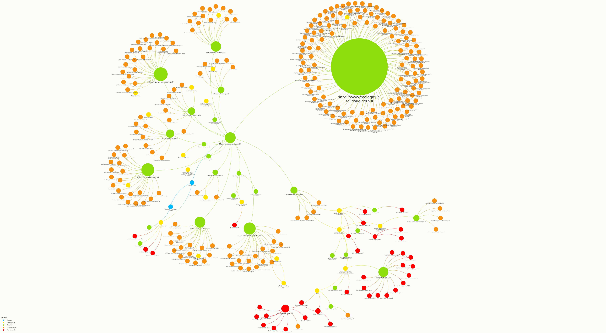

# Représentation en *graph* des sites et services web en `.gouv.fr`

Suite à la liste des sites web en `.gouv.fr` générée sur le dépôt [GitHub gouvfrlist](https://github.com/bzg/gouvfrlist/blob/master/tested.gouv.fr.txt), voici une représentation des domaines et sous-domaines par ministère et administrations (déconcentrées). Nous nous sommes également appuyé sur la liste du [**top 250** des démarches administratives](https://www.numerique.gouv.fr/actualites/qualite-des-services-numeriques-deux-nouveaux-outils-pour-suivre-lavancee-de-la-dematerialisation-et-recueillir-lavis-des-usagers/), la [liste des sites en .gouv.fr datant de 2014](https://www.data.gouv.fr/fr/datasets/listes-des-sites-gouv-fr/) et surtout la [liste des noms de domaine `.fr` de l'AFNIC en open data](https://opendata.afnic.fr) .

## Représentations 

Les objets représentés sont :
- Le Président de la République française et le Premier ministre sont qualifiés sous le type "Person" (en bleu)
- Les ministères ou directions administratives (en jaune)
- Les sites web (en vert)
- Les sous-domaines de ces sites-web (en orange)
- Les services en ligne (en rouge)
- Les sites web de consultation citoyenne (en rose)
- Les sites web off ou archivés (en noir)

## Dépôt GitHub

La description du projet et l'ensemble des données sont accessibles dans le dépôt Github [graph-gouv-fr de jbledevehat](https://github.com/jbledevehat/graph-gouv-fr)

## Licence 
Jean-Baptiste Le Dévéhat 

2019 en Licence Ouverte 2.0